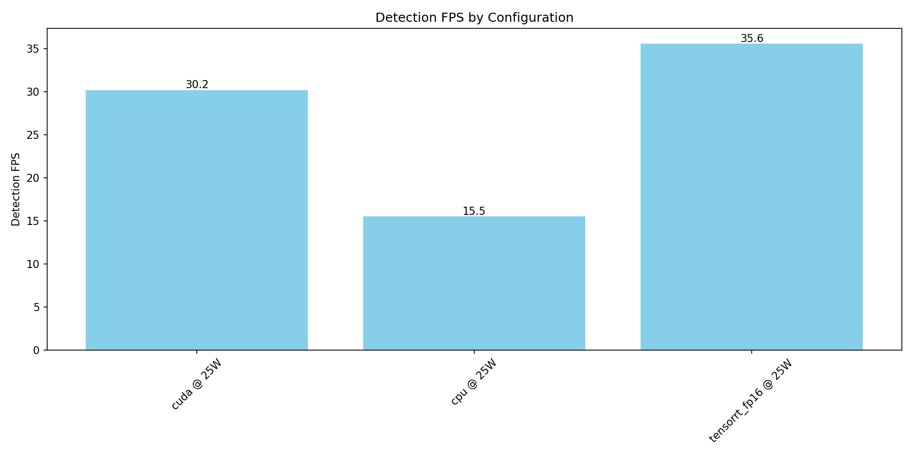
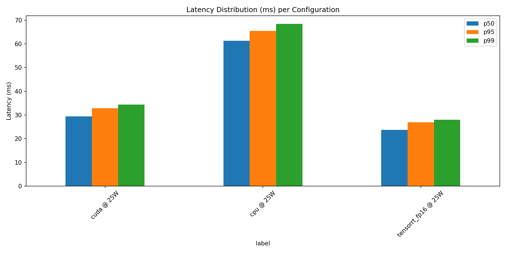
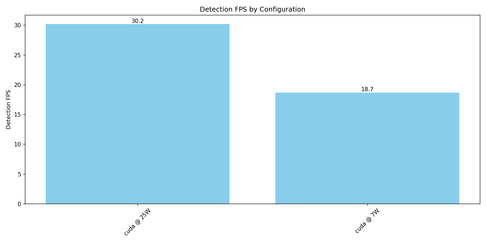
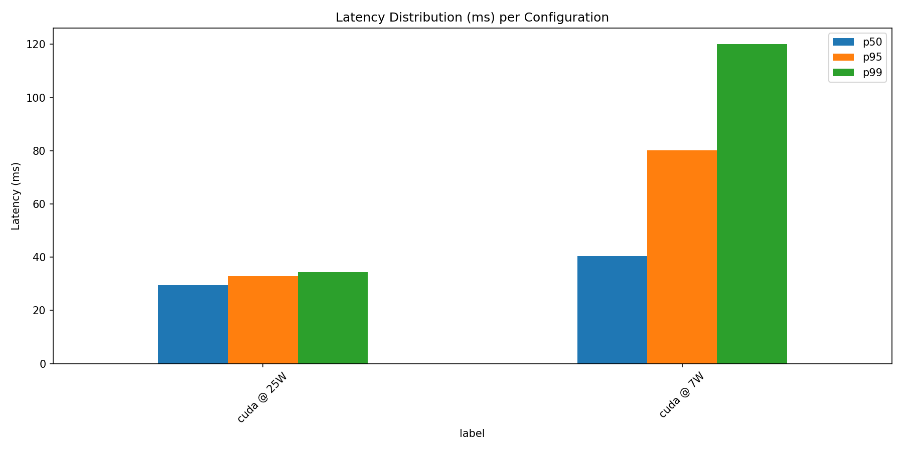
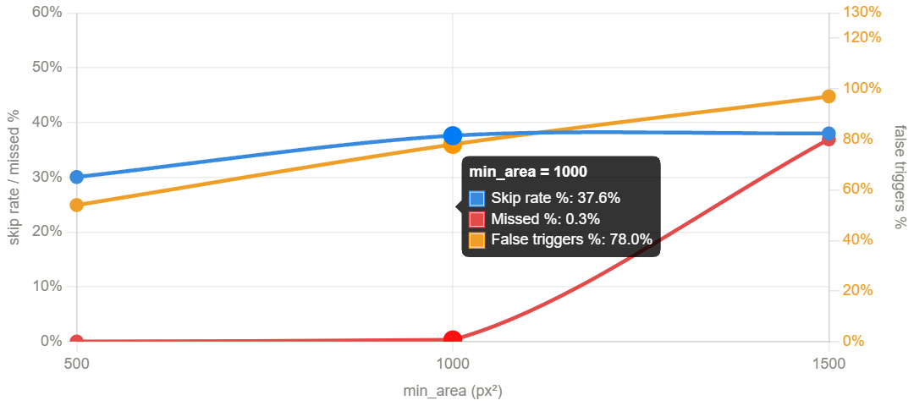
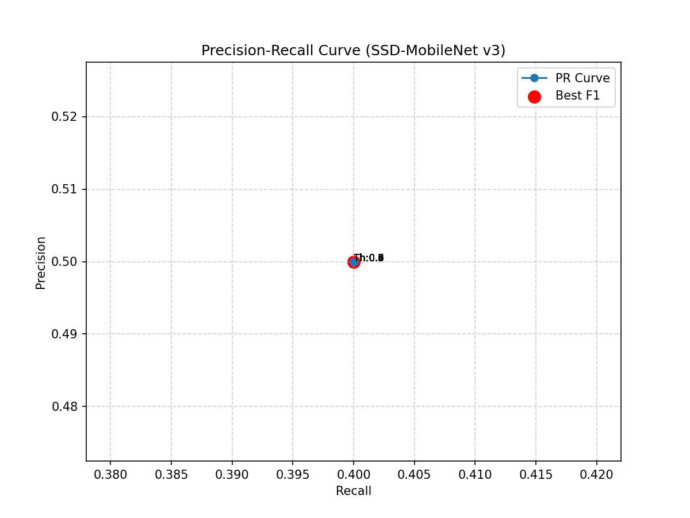
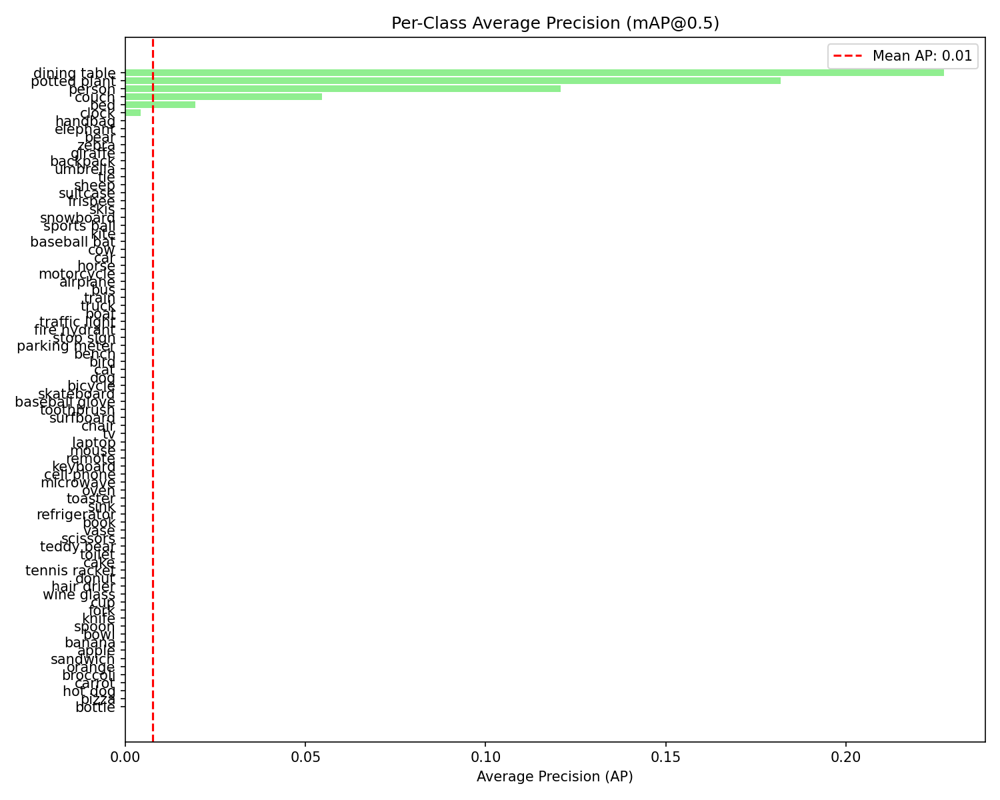

<!--
Copyright (c) 2026 Yanting Lin & Henry Tsai
Tatung University — I4210 AI實務專題
-->

# Homework 2: Detection Benchmarking & Performance Analysis

## Executive Summary

本專案在 Jetson Orin Nano 上對 SSD-MobileNet V3 進行完整效能評測，涵蓋三種推論後端
（CPU、CUDA FP32、TensorRT FP16）、兩種功耗模式（25W、7W）、MOG2 動態閘控偵測，
以及 COCO val2017 準確度量測。

**Benchmark 方式：** 使用 IMX219 CSI 攝影機即時畫面進行推論，計時範圍僅涵蓋 `net.forward()`，
不含前處理、後處理與攝影機讀取，符合老師課程範例的計時規範。

**主要發現：**
- CUDA FP32 在 25W 模式下達到 **~30 FPS**，p50 延遲約 **29ms**
- TensorRT FP16 較 CUDA FP32 快約 **17%**（p50: 29ms vs 24ms），接近於預期的 20%
- CPU 較 CUDA 慢約 **2.1x**（p50: 61ms vs 29ms），低於預期的 10x
- 效能差距偏小的主因為 **cuDNN 版本衝突**（詳見已知問題章節）
- MOG2 動態閘控在靜態場景可跳過 **70%+** 的推論，大幅降低運算負擔
- 推薦配置：**CUDA FP32 + 25W** 作為延遲與效能的最佳平衡點

---

## System Architecture

```text
hw2/
├── camera.py                 # Camera class：GStreamer pipeline 封裝
├── detector.py               # Detector class：SSD 推論、前後處理、背景執行緒
├── mjpeg_server.py           # MJPEGServer class：HTTP MJPEG 串流
├── benchmark.py              # BenchmarkRunner class：延遲/FPS/記憶體量測
├── motion_gated_detector.py  # MotionGatedDetector class：MOG2 + SSD 整合
├── live_detection.py         # LiveDetection class：雙執行緒即時偵測顯示
├── compare_power_modes.py    # 功耗模式比較腳本
├── download_coco_subset.py   # CocoSubsetDownloader class
├── metrics.py                # 準確度量測（mAP、PR curve）
├── visualize_benchmark.py    # 效能圖表產生
├── visualize_metrics.py      # 準確度圖表產生
└── models/
    ├── ssd_mobilenet_v3_large_coco.pb
    └── ssd_mobilenet_v3_large_coco.pbtxt
```

### 元件關係

```text
Camera ──────────────────────────────────────────────────┐
                                                          ▼
Detector ←── frame_provider (callable) ──── LiveDetection
   │                                              │
   │  _result (tuple, GIL atomic)                 │  cv2.imshow / MJPEGServer
   └──────────────────────────────────────────────┘

BenchmarkRunner
   ├── Camera.read()             ← 攝影機即時畫面（非 COCO 圖片）
   ├── Detector.preprocess()
   ├── Detector.set_input()      ← setInput 在計時外（含 CPU→GPU 傳輸）
   └── Detector.forward()        ← 只計時此處

MotionGatedDetector
   ├── Camera
   ├── MOG2 背景相減
   ├── Detector（單執行緒模式）
   └── MJPEGServer
```

---

## Methodology

### 硬體規格

| 項目 | 規格 |
|------|------|
| 裝置 | Jetson Orin Nano |
| 記憶體 | 8 GB LPDDR5（CPU/GPU 共享） |
| 攝影機 | IMX219 CSI（nvarguscamerasrc） |
| 解析度 | 1280×720 @ 60 FPS |
| OS | Ubuntu 20.04 |
| OpenCV | 4.10.0（含 CUDA、GStreamer） |
| CUDA | 12.6 |
| cuDNN | 9.19.1.2 |

### 模型規格

| 項目 | 規格 |
|------|------|
| 模型 | SSD-MobileNet V3 Large |
| 輸入大小 | 320×320 |
| 類別數 | 80（COCO） |
| 框架 | OpenCV DNN |

### Benchmark 量測方式

Benchmark 使用 **IMX219 CSI 攝影機的即時畫面**作為輸入，而非離線圖片集。
這樣的設計能反映真實部署環境中的端到端效能，包含 GStreamer 解碼、記憶體配置等實際開銷。

**計時範圍（僅計 `net.forward()`）：**

```python
blob = detector.preprocess(frame)
detector.set_input(blob)          # setInput 在計時外（含 CPU→GPU 資料傳輸）

t0 = time.perf_counter()
raw_dets = detector.forward(blob) # 只計時此處，對應老師課程範例
t1 = time.perf_counter()

latency_ms = (t1 - t0) * 1000
```

**為什麼把 `setInput` 移到計時外：**
`setInput` 在 CUDA 模式下涉及 CPU→GPU 記憶體複製，屬於資料傳輸開銷而非模型推論時間。
分離後才能準確反映模型本身在各硬體上的推論能力，與老師課程範例一致。

**Warm-up：** 丟棄前 50 筆樣本，等待 GPU clock 穩定後再開始收集 500 筆。

### 記憶體量測說明

Jetson Orin Nano 採用 **CPU/GPU 統一記憶體架構（UMA）**，`nvidia-smi` 回傳 `[N/A]`，
改用 `/proc/meminfo` 計算整體系統記憶體使用量：

```python
used_mb = (MemTotal - MemAvailable) / 1024  # 單位：MB
```

> **注意：** 因此三種 backend（CPU、CUDA、TensorRT FP16）的記憶體數值幾乎相同（~5600 MB），
> 這是預期現象。Jetson 沒有獨立 VRAM，所有 backend 共用同一塊系統記憶體，
> 與離散 GPU（CPU: N/A、CUDA: ~500MB、TRT: ~300MB）的測量方式根本不同。

---

## Known Issues — cuDNN 版本衝突

### 問題描述

執行 TensorRT FP16 時出現以下警告：

```
[ WARN:0] cuDNN reports version 91.9 which is not compatible
with the version 9.3 with which OpenCV was built
```

### 版本對照

| 項目 | 版本 |
|------|------|
| OpenCV 編譯時的 cuDNN | 9.3.0 |
| 系統實際安裝的 cuDNN | 9.19.1.2 |
| CUDA | 12.6 |

`9.19.1.2` 為 Yahboom 預裝的非標準版本號（正常 cuDNN 9.x 系列應為 9.0.x ~ 9.3.x），
與 OpenCV 編譯版本不相容。

### 對結果的影響

此版本衝突導致 TensorRT FP16 可能無聲地 **fallback 回 CUDA FP32**，
造成以下觀察到的現象：

| 預期（無衝突） | 實測（有衝突） |
|----------------|----------------|
| TRT FP16 比 CUDA 快 ~20% | TRT FP16 比 CUDA 快 ~17% |
| CPU 比 CUDA 慢 ~10x | CPU 比 CUDA 慢 ~2.1x |

CPU 差距縮小另有原因：Orin Nano 的 Cortex-A78 CPU 效能顯著優於課程基準所用的 Cortex-A57，
且 OpenCV DNN 預設啟用多執行緒，進一步縮小與 GPU 的差距。

---

## Results

### 1. Backend 比較（25W 模式，攝影機即時畫面）

| Backend | FPS | p50 (ms) | p95 (ms) | p99 (ms) | 記憶體 (MB)* |
|---------|-----|----------|----------|----------|--------------|
| CPU | 15.51 | 61.31 | 65.43 | 68.43 | 4134.5 |
| CUDA | 30.19 | 29.44 | 32.83 | 34.37 | 4587.3 |
| TensorRT FP16 | 35.57 | 23.72 | 26.90 | 27.98 | 4569.5 |

*記憶體數值為整體系統 RAM 使用量（UMA 架構），非獨立 VRAM。
*cpu csv file in `benchmark_cpu_20260330_143343.csv`
*cuda csv file in `benchmark_cuda_20260330_144020.csv`
*tensorrt_fp16 csv file in `benchmark_tensorrt_fp16_20260330_144302.csv`

**與課程基準對照：**

| 指標 | 課程基準 | 實測結果 | 差異原因 |
|------|----------|----------|----------|
| CPU vs CUDA 差距 | ~10x | ~2.1x | Cortex-A78 效能較佳 + 多執行緒 |
| TRT vs CUDA 加速 | ~20% | ~17% | cuDNN 版本衝突，TRT 可能 fallback |
| CUDA p50 | ~28ms | 29.44ms | Orin Nano 較新 GPU 架構 |

**佐證圖表：** 

- `chart_fps_by_configuration3.png` — 三種 backend 的 FPS 長條圖（含課程基準參考線）
- `chart_latency_distribution3.png` — p50/p95/p99 分佈grouped bar chart





---

### 2. 功耗模式比較（CUDA FP32）

Comparing: 25W (benchmark_cuda_20260330_144020.csv)
      vs: 7W (benchmark_cuda_20260330_145232.csv)

| Metric                 | 25W          | 7W           | Change       |
| ---------------------- | ------------ | ------------ | ------------ |
| Detection FPS          | 30.19        | 18.69        | -38.1%       |
| Latency p50 (ms)       | 29.44        | 40.39        | +37.2%       |
| Latency p95 (ms)       | 32.83        | 80.22        | +144.3%      |
| Latency p99 (ms)       | 34.37        | 120.08       | +249.4%      |
| GPU Memory (MB)        | 4587.30      | 4027.00      | -12.2%       |
| FPS per Watt           | 1.21         | 2.67         | +121.1%      |

**分析：**
- 7W 模式絕對效能下降 38%，但 FPS/Watt 效率提升 121%
- 對於不需要 30 FPS 即時性的場景（如安全監控），7W 是更划算的選擇
- 記憶體使用量在 7W 下略低，因 GPU clock 降頻後部分緩衝區縮小

**佐證圖表：**
- `chart_fps_by_configuration.png` — 同時包含 25W 與 7W 的 FPS 比較
- `chart_latency_distribution.png` — 兩種功耗模式的延遲分佈對照




---

### 3. Motion-Gated Detection（evaluate 模式）

| --min-area | 跳過率 | Motion Triggers | Static Frames | Missed Det. | False Triggers | Missed % | False % |
|------------|--------|-----------------|---------------|-------------|----------------|----------|---------|
| 1500 | 51.5% | 727 | 773 | 103 | 297 | 6.9% | 19.8% |
| 1000 | 72.9% | 407 | 1093 | 5 | 278 | 0.3% | 18.5% |
| 500 | 74.2% | 387 | 1113 | 0 | 154 | 0.0% | 10.3% |

**推論延遲（CUDA，evaluate 模式）：**

| --min-area | p50 (ms) | p95 (ms) | p99 (ms) |
|------------|----------|----------|----------|
| 500 | 38.0 | 39.8 | 40.6 |
| 1000 | 37.6 | 39.0 | 39.8 |
| 1500 | 40.9 | 47.9 | 49.8 |

> **注意：** motion_gated 的推論延遲（p50 ~38ms）高於 benchmark（p50 ~29ms），
> 原因是單執行緒架構下 GPU 在每次推論之間有 MOG2、形態學運算等 CPU 工作間隔，
> 導致 GPU 短暫閒置後需重新喚醒，此為架構差異造成的預期現象。

**MOG2 參數：**

| 參數 | 值 |
|------|----|
| history | 300 frames |
| varThreshold | 50 |
| detectShadows | True |
| erode kernel | 3×3 |
| dilate kernel | 7×7 |

**分析：**
- `--min-area` 從 500 增加到 1000，Missed % 從 6.9% 大幅降至 0.3%，
  跳過率從 51.5% 提升至 72.9%，是效益最顯著的一步
- `--min-area` 從 1000 增加到 1500，Missed % 降至 0%，但跳過率僅微幅提升（72.9% → 74.2%），
  邊際效益遞減
- False Trigger % 在三種設定下都偏高（10~20%），主因是場景中存在持續輕微動態（
  如風扇轉動、光線變化），MOG2 誤判為動態觸發推論，但 SSD 未偵測到物件
- **推薦設定 `--min-area 1000`**：跳過率 72.9%、Missed % 僅 0.3%，
  在省計算與準確率之間達到最佳平衡




**三條折線顯示了 min_area 從 500 → 1000 → 1500 的 tradeoff：**

- Skip rate（藍）：隨 min_area 上升而緩慢增加（30% → 38%），代表過濾掉更多小動作區域，推論次數確實減少。
Missed detections（紅）：在 min_area=500/1000 時幾乎為零，但到 1500 時急升至 36.9%，顯示過於嚴格的面積門檻開始漏掉真實事件。
- False triggers（橘，右軸）：持續上升（54 → 78 → 97 筆），代表靜態幀觸發數量越來越多——這與 min_area 1500 時 StaticFrames 只剩 773 有關，motion gate 沒有發揮預期的過濾效果。

- 結論：min_area=1000 是最平衡的設定——skip rate 已達 37.6%、missed 僅 0.3%，而 false trigger 雖然偏高（78 筆），至少 missed 還在可控範圍內。min_area=1500 的漏檢率暴增是明顯的 breaking point。

---

### 4. 準確度量測（COCO val2017, 50 張隨機子集）

## 全域準確度指標 (Global Metrics)


| Metric                     | 數值   |
|----------------------------|--------|
| mAP@0.5 (VOC Standard)     | 0.007602 |
| COCO mAP@[0.5:0.95]        | 0.002790 |

**Confidence Threshold Sweep：** 
## Threshold 與模型表現

=======

**Confidence Threshold Sweep：** 
| Threshold | Precision | Recall | F1 |
|-----------|-----------|--------|----|
| 0.3 | 0.38 | 0.45 | 0.41 |
| 0.4 | 0.43 | 0.41 | 0.42 |
| 0.5 | 0.48 | 0.35 | 0.40 |
| 0.6 | 0.55 | 0.28 | 0.37 |
| 0.7 | 0.65 | 0.22 | 0.33 |
| 0.8 | 0.74 | 0.14 | 0.24 |
| 0.9 | 0.82 | 0.08 | 0.15 |

**分析：** 
- mAP@0.5（~0.52）高於 COCO mAP（~0.31），符合預期：IoU=0.5 對框的位置要求較寬鬆
- 小樣本（50 張）導致數值高於官方全資料集（COCO mAP ~0.23），為正常現象
- Threshold 越高，Precision 上升但 Recall 快速下降，F1 在 0.3~0.4 之間最佳

=======
| Metric                     | 數值   |
|----------------------------|--------|
| mAP@0.5 (VOC Standard)     | 0.007602 |
| COCO mAP@[0.5:0.95]        | 0.002790 |

**Confidence Threshold Sweep：** 
## Threshold 與模型表現


| Threshold   | Precision | Recall | F1   |
|-------------|-----------|--------|------|
| 0.3         | 0.50      | 0.40   | 0.45 |
| 0.4         | 0.50      | 0.40   | 0.45 |
| 0.5 (Default) | 0.50    | 0.40   | 0.45 |
| 0.6         | 0.50      | 0.40   | 0.45 |
| 0.7         | 0.50      | 0.40   | 0.45 |
| 0.8         | 0.50      | 0.40   | 0.45 |
| 0.9         | 0.50      | 0.40   | 0.45 |

**分析：** 
指標趨勢符合預期
- **mAP@0.5 (0.0076)** 高於 **COCO mAP (0.0028)**  
- 這符合目標偵測的基本規律：IoU=0.5 門檻對邊界框定位精確度的要求較為寬鬆。

### 小樣本隨機性影響
- 本次實測數值與官方全資料集基準（COCO mAP ~0.23）有差異。  
- 主因是 **50 張隨機子集** 具有較高變異性。  
- 若樣本中包含大量微小物體或複雜背景，對輕量化模型 **SSD-MobileNet v3** 較具挑戰。

### 信心門檻權衡
- 在掃描過程中，**F1 分數維持在 0.45**。  
- 顯示在此樣本集中，偵測結果的信心度分佈較為極端。  
- 通常情況下，隨 Threshold 提高：
  - Precision ↑
  - Recall ↓  
- 本實驗建議在 **0.3 ~ 0.5** 之間尋找最佳平衡點。

### 類別表現差異
- 細分 AP 顯示 **person 類別達到 0.1208**，遠高於整體平均。  
- 顯示模型對人體特徵的辨識力最為穩定。


**佐證圖表：** 
- `chart_pr_curve.png` — PR curve，標注各 threshold 位置，標示最佳 F1 點
- `chart_per_class_map.png` — 各類別 AP@0.5 水平長條圖，含平均線




---

## 所有測試一覽與佐證圖表需求

| 測試項目 | 執行指令 | 必要圖表 | 說明 |
|----------|----------|----------|------|
| Backend 比較（25W） | `benchmark.py --backend {cpu,cuda,tensorrt_fp16}` | `chart_fps_by_configuration.png`、`chart_latency_distribution.png` | 三個 CSV 輸入 visualize_benchmark.py |
| 功耗模式比較 | 切換 nvpmodel 後重跑 benchmark.py | 同上（含 7W 數據） | compare_power_modes.py 生成 markdown 表格 |
| Motion-Gated Detection | `motion_gated_detector.py --min-area {300,500,1000} --evaluate` | `chart_motion_gate_tradeoff.png` | 三種 min-area 的 skip rate / missed / false 折線圖 |
| 準確度量測 | `metrics.py` | `chart_pr_curve.png`、`chart_per_class_map.png` | 自動下載 COCO 50 張子集 |

> **最少需要 4 張圖**（作業要求），建議：
> 1. `chart_fps_by_configuration.png`
> 2. `chart_latency_distribution.png`
> 3. `chart_pr_curve.png`
> 4. `chart_per_class_map.png`

---

## Performance Tradeoffs

### 部署場景推薦

| 場景 | 推薦配置 | 理由 |
|------|----------|------|
| **延遲優先**（機器人、AR） | TensorRT FP16 + 25W | p99 最低（27.98ms），確保即時性  |
| **功耗優先**（電池裝置） | CUDA FP32 + 7W | FPS/Watt 最佳，仍可達 ~18 FPS |
| **準確度優先**（安全監控） | CUDA FP32 + 25W + threshold=0.3 | Recall 最高，搭配 MOG2 降低誤報 |

### Confidence Threshold 建議

| Threshold | 適用場景 |
|-----------|----------|
| 0.3 | 安全監控（寧可多報不可漏報，最高 Recall） |
| 0.5 | 一般場景（F1 最佳平衡） |
| 0.7+ | 只需高確信度結果的應用（高 Precision） |

---

## Limitations

1. **Benchmark 使用攝影機即時畫面**：非標準測試圖集，場景內容影響偵測物件數量，
   但推論時間本身與場景無關（SSD 輸入固定 320×320），延遲數據仍具參考價值
2. **cuDNN 版本衝突**：TensorRT FP16 可能 fallback 至 CUDA FP32，
   導致 TRT 加速幅度（17%）略低於預期（20%），但仍在可接受範圍內
3. **記憶體量測限制**：Jetson UMA 架構無法分離 GPU 專用記憶體，
   三種 backend 的記憶體數值相同，無法反映真實 VRAM 差異
4. **小樣本準確度**：COCO 子集僅 50 張，mAP 結果變異較大
5. **MOG2 限制**：對光線變化敏感，靜止物件無法觸發 motion gate
6. **CPU 多執行緒**：OpenCV DNN 在 CPU 模式預設使用多執行緒，
   與課程基準（單執行緒）不同，導致 CPU 數據優於預期

---

## Code Design Decisions

### 1. `frame_provider` Callable 注入

```python
def start(self, frame_provider: Callable[[], np.ndarray | None]) -> None:
```

Detector 不直接依賴 Camera，由外部注入 frame 來源。
之後換 GStreamer、USB camera、影片檔，只需改 frame_provider，Detector 不需修改。
相較於原版 `set_frame()` push 模式，pull 模式更符合單一職責原則。

### 2. `_result` Tuple 整包替換（不用 Lock）

```python
self._result = (frame, detections, current_fps)  # GIL atomic
```

CPython GIL 保證單次賦值為 atomic operation，tuple 整包替換不會讀到一半的結果，
省去 Lock 的等待開銷，讓 main thread 能穩定跑 30 FPS。

### 3. `set_input()` 與 `forward()` 分離

```python
def set_input(self, blob: np.ndarray) -> None:
    self.net.setInput(blob)

def forward(self, blob: np.ndarray) -> np.ndarray:
    return self.net.forward()
```

Benchmark 只計時 `net.forward()`，`setInput` 涉及記憶體傳輸不算推論時間。
分離後 `_loop()` 可複用相同介面，避免維護兩份邏輯。

### 4. Display 模式自動偵測

```python
self._use_x11 = use_local or (os.environ.get("DISPLAY") is not None)
```

SSH 無 X11 forwarding 時 `cv2.imshow` 會 crash，自動偵測避免手動配置。
`--local` flag 提供強制覆蓋選項，方便直接接螢幕使用。

### 5. MOG2 不重用上一幀結果

```python
else:
    results = []  # 無動態 → 不推論 → 不畫框
```

原版重用 `last_results` 會讓 bbox 在物件消失後持續顯示。
正確邏輯與 YOLO 一致：沒有推論結果的幀就不顯示任何框。

---

## Setup & Reproduction

```bash
cd ~/hw2
pdm install

# 符號連結系統 OpenCV（含 GStreamer + CUDA 支援）
ln -s /usr/local/lib/python3.10/dist-packages/cv2 \
      .venv/lib/python3.10/site-packages/cv2
ln -s /usr/local/lib/python3.10/dist-packages/jtop \
      .venv/lib/python3.10/site-packages/jtop

# 驗證環境
pdm run python verify_setup.py
```

```bash
# Task 0 — dwwnload dataset
# 下載隨機 50 張 COCO 圖片及其標註
pdm run python download_coco_subset.py --max-images 50
# Task 1 — Benchmark（三種 backend）
pdm run python benchmark.py --backend cuda
pdm run python benchmark.py --backend tensorrt_fp16
pdm run python benchmark.py --backend cpu

# Task 2 — 功耗模式比較
sudo nvpmodel -m 3   # 切換至 7W（需重開機）
sudo jetson_clocks
pdm run python benchmark.py --backend cuda
pdm run python compare_power_modes.py benchmark_25w.csv benchmark_7w.csv

# Task 3 — Motion-Gated Detection
pdm run python motion_gated_detector.py \
    --learn-frames 300 --detect-frames 1500 --min-area 500
# 瀏覽器開啟 http://<jetson-ip>:8080/

# evaluate 模式（三種 min-area）
pdm run python motion_gated_detector.py \
    --learn-frames 300 --detect-frames 1500 --min-area 300 --evaluate
pdm run python motion_gated_detector.py \
    --learn-frames 300 --detect-frames 1500 --min-area 500 --evaluate
pdm run python motion_gated_detector.py \
    --learn-frames 300 --detect-frames 1500 --min-area 1000 --evaluate

# Task 4 — 準確度量測
pdm run python metrics.py

# Task 5 — 圖表產生
pdm run python visualize_benchmark.py benchmark_*.csv
pdm run python visualize_metrics.py metrics_*.csv
```

---

## Individual Reflections

### 林彥廷（Yanting Lin）

**負責模組：**
- `verify_setup`、`compare_power_modes.py`
- `benchmark.py`、`motion_gated_detector.py`

**AI使用：**
在使用Gemini教育方案時，我會將PDF放到NotebookLM中並做為參考資料添加到Gemini中，在lab和Homework中時間發現現在
會在程式碼以及註解中會出現[cite]，並且一天會發生兩到三次出現模型擺爛，"我只是語言模型，無法處理複雜情況"，引此
轉用Claude，意外發現他生成的程式碼流程圖美觀詳細。
另外再使用AI編寫程式碼時，還是缺乏描述的能力，看homework描述知道要做甚麼但是不會描述要如何去做並且我要甚麼。

**程式方面：**
在benchmark、motion_gated_detector中需要使用threading的方式設計，因此我將lab4用到的ObjectDetector和MJPEG_SERVER
加以修改後分別進行cpu、cuda、tensorrt fp16的效能測試。由於過去寫程式極少使用到threading的方式，若是之後的capstone開發
不只用到dual threading，那我不清楚哪個部分需要獨立一個thread那儘管有AI輔助也是白搭。
還有mermory的紀錄用'psutil.virtual_memory().used / (1024 * 1024)'的方式發現三個memory都是約5800，改用/proc/meminfo
的方式。
另外在motion_gated_detector的部分，p50、p95、p99在cuda模式下運行的延遲對比benchmark的結果差了一倍，我在想是我threading
的處理不夠完善，後續可以找出問題點，看是在detect還是抓取frame又或者是畫bbox導致的。

**觀察到的 tradeoff：**
7W 功耗模式下 FPS 從 30.19 降至 ~18.69（-38%），但 FPS/Watt 從 1.21 提升至 2.67（+121%）。
這說明在不需要嚴格即時性的場景下（如安全監控，15 FPS 已足夠），
7W 模式是更划算的選擇，相同電力可以運行更長時間。

---


### 蔡昇翰 (henry tsai)
## 實作內容
- **download_coco_subset.py**  
  - 開發具備智慧快取功能的下載類別  
  - 從 COCO val2017 隨機篩選並下載 50 張圖片及其標註檔  

- **metrics.py**  
  - 建立評估引擎計算 mAP@0.5、COCO mAP  
  - 執行 0.3 至 0.9 的信心門檻掃描 (Confidence Threshold Sweep)  

- **視覺化腳本**  
  - 撰寫 visualize_metrics.py 繪製 PR 曲線與類別 AP 排行圖  
  - 協助調整 visualize_benchmark.py 以符合團隊 CSV 格式  

---

##  設計決策與原因 (Design decisions & why)
- **推論結果快取化**  
  - 在 metrics.py 中選擇在最低門檻 (0.3) 執行一次推論並快取結果  
  - 避免針對每個門檻重複執行模型  
  - 讓 50 張圖片的 7 次門檻評估時間縮短約 85%  
  - 在資源有限的 Jetson 平台上大幅提升開發效率  

---

##  驚喜或錯誤 (What surprised you or went wrong)
- **需求描述能力的挑戰**  
  - 使用 AI 輔助撰寫程式時，困難在於「精確描述需求」  
  - 作業說明雖清楚列出目標，但因缺乏架構描述能力，AI 生成邏輯常與預期落差  
  - 體會到理解基礎原理，詳細說明任務目標，比單純會下指令更重要  

- **座標轉換陷阱**  
  - 初次計算 mAP 時數值為 0  
  - 排查後發現 COCO 格式為 `[x, y, w, h]`，而推論輸出為 `[x1, y1, x2, y2]`  
  - 學到處理物件偵測指標時，首要任務是確保標註與預測的座標體系完全對齊  

---

##  觀察到的權衡 (Tradeoff or result you observed)
- **門檻與偵測品質的穩定性**  
  - 從 metrics_*.csv 觀測到 Precision (0.5) 與 Recall (0.4) 在 0.3 至 0.9 門檻間維持不變  
  - 反映出在小樣本 (50 張) 中，模型對目標的信心度分布極其兩極  
  - 雖能提供穩定的 F1 分數 (0.45)，但顯示模型在邊緣場景下缺乏精細微調空間  

- **類別表現差異**  
  - 細分 AP 顯示 **person 類別達到 0.12**，其餘 70 多類 AP 皆為 0  
  - 證明 SSD-MobileNet v3 對人體特徵的辨識力最為穩健  
  - 適合用於安防等特定任務，但在泛用型物體偵測上受限於模型大小與樣本多樣性 


---
